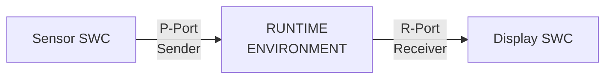

# AUTOSAR Application Layer


- Table of Contents:
  - Application Layer Overview
    - Data Types
    - Compu Methods
    - Software Components
  - RTE Layer Overview


- AUTOSAR Application Layer:

  - The topmost layer in AUTOSAR software architecture.
  - Application is the main layer to drive the Vehicle System.

  

  

  - Application is a group of components, interacting together to do specific funcitonality.
  - Software Components of the same application can be distributed over different ECUs in the Vehicle System.
  - SWC aren't necessarily part of the same ECU, they can be distributed over multiple ECUs.
  - SWC aren't necessarily functions.


- Virtual Function Bus (VFB): is a bus that has SWCs of all functionalities connected on it.
- RTE is the actual implementation of Virtual Function Bus. 


- VFB is a modeling for application to interact together through Virtual Connections.
- Gateway ECUs: they gateway from one bus to another (from one protocol to another)


- Application layer consists of various set of interconnected Software Components (SWCs)
- A SWC is the simplest form of an application that fulfills certain functionality.
- SWCs connect  to each other through ports to exchange data and services needed to fulfill the desired functionality.


- Base Datatype: such as uint8, uint16, uint32, etc.
- Implementation Datatypes: maps application datatypes to base datatypes
  e.g.: Application Datatype: Celsius (Application Dataype) mapped to uint8 (Base Datatype) 


AUTOSAR introduces these three layers to achieve a critical goal: **separation of concerns** and **portability**. It ensures that:

1. Application software components (SWCs) don't care about the underlying hardware (e.g., 8-bit vs 32-bit microcontroller).
2. The same application code can be easily ported to a different ECU without changes.
3. The meaning and physical units of data are clearly defined and consistent across the entire system.

Think of it like this:

- **Application Datatype:** What the data *means* (e.g., "Temperature").
- **Implementation Datatype:** How the data is *formatted and constrained* for a specific use case (e.g., "A number from -40 to 210 representing degrees Celsius").
- **Base Datatype:** How the data is *actually stored* in memory (e.g., `uint8` - a single byte).

------

### 1. Base Datatypes

- **What they are:** The fundamental building blocks. These are the primitive types provided by the programming language (C) and compiler that directly define the memory footprint and representation.
- **Purpose:** To define the physical storage of data in memory. They are hardware-dependent.
- **Examples:**
  - `uint8` (unsigned 8-bit integer)
  - `uint16` (unsigned 16-bit integer)
  - `sint32` (signed 32-bit integer)
  - `float32` (32-bit floating point)
  - `boolean` (typically mapped to `uint8`)

------

### 2. Implementation Datatypes

- **What they are:** A "wrapper" or "typedef" around a Base Datatype that adds **semantic meaning and constraints**. They map the abstract application concept to a concrete physical representation.
- **Purpose:** To define the range, precision, and encoding of a value that has a specific purpose in the application. This is where engineering decisions are made.
- **How they work:** They are defined using the Base Datatype and specify:
  - **`baseType`:** The underlying Base Datatype (e.g., `uint8`).
  - **`min` / `max`:** The allowed range of values.
  - **`resolution`:** The smallest step between values (e.g., 0.5).
  - **`offset`:** A constant offset.
  - **`unit`:** The physical unit (e.g., `degC`).
- **Example:**
  - **Name:** `Celsius_t`
  - **BaseType:** `uint8`
  - **Constraints:** `min = 0`, `max = 250`, `unit = "degC"`, `offset = -40`
  - **This means:** The value `0` in memory represents -40°C, the value `100` represents 60°C, and the value `250` represents 210°C.

------

### 3. Application Datatypes

- **What they are:** The most abstract level. These are the types used by the application software components (SWCs) to define their interfaces. They describe the *logical data* without any hardware or implementation details.
- **Purpose:** To allow application developers to work with meaningful concepts rather than raw bytes. This makes the code self-documenting and portable.
- **Examples:**
  - `Temperature`
  - `EngineSpeed`
  - `VehicleSpeed`
  - `DoorStatus` (e.g., with enum values: `DOOR_OPEN`, `DOOR_CLOSED`)

------

### How They Work Together: The Mapping

Your description and the slide show the crucial link: **mapping**.

1. The **Application Datatype** (e.g., `Temperature`) is used in the software component.
2. The AUTOSAR toolchain **maps** this abstract type to a specific **Implementation Datatype** (e.g., `Celsius_t`).
3. The Implementation Datatype is itself defined by its **Base Datatype** (e.g., `uint8`).

This mapping is configured in the AUTOSAR authoring tools and is a key part of the system design. The **RTE (Run-Time Environment)** uses this mapping to ensure that when one SWC sends a `Temperature` signal, it is correctly encoded and decoded into a `uint8` on the bus or between ECUs.

### Concrete Example:

| Layer                       | Example                                                      | Purpose                                                   |
| :-------------------------- | :----------------------------------------------------------- | :-------------------------------------------------------- |
| **Application Datatype**    | `Temperature`                                                | Describes the **logical concept** of temperature.         |
| **Implementation Datatype** | `Celsius_t` (uint8, min=0, max=250, offset=-40, unit="degC") | Defines the **encoding and constraints** for temperature. |
| **Base Datatype**           | `uint8`                                                      | Defines the **physical storage** (1 byte in memory).      |

**In Code, this might look like:**

c

```
/* This is generated by the AUTOSAR tooling */
typedef uint8 Celsius_t; // Implementation Datatype

/* The Application Developer uses the meaningful type */
Temperature currentEngineTemp; // Application Datatype

void MyComponent_Logic() {
    // The RTE handles the mapping from 'Temperature' to 'Celsius_t'
    currentEngineTemp = RTE_Read_Sensor_Temperature();

    if (currentEngineTemp > 100.0) { // Application works with logical values
        // ... trigger cooling ...
    }
}
```


This layered approach is why AUTOSAR is so powerful for complex, multi-supplier automotive systems. It creates a clear contract between application logic and hardware implementation.


### What is a CompuMethod?

A **CompuMethod** is a set of rules or a formula that defines how to convert between two representations of the same data:

1. **Internal Value:** The raw number as it is stored and processed in the software and on the bus (e.g., in a `uint8` variable).
2. **Physical Value:** The real-world, human-readable value with a unit that the number represents (e.g., temperature in °C, speed in km/h).

It's the "translator" between the digital world of the ECU and the physical world.

### Why are CompuMethods Needed?

In automotive systems, data is often compressed or encoded to save bandwidth on communication buses (like CAN) or to fit into a specific number of bits.

**Example:**

- A vehicle speed sensor needs to send a value from 0 to 300 km/h.
- Using a full `float32` (4 bytes) for this is inefficient on a CAN bus.
- Instead, we can use a `uint8` (1 byte) and define a scaling.
- The `uint8` can hold values from 0 to 255. We can scale this to represent 0 to 255 km/h. But what if we need up to 300 km/h?
- We can use a more complex scaling: `physical_value = (internal_value * 1.25) + 0`. Now, an internal value of `200` translates to `250 km/h`.

The CompuMethod defines this `(internal_value * 1.25) + 0` rule.

### How CompuMethods Work (The Transformation)

The slide's example of `km/hr` and `m/hr` hints at the two main types of transformations:

1. **Linear Scaling:** The most common type. It uses the formula:
   **`physical_value = (internal_value \* factor) + offset`**
   - **Factor (Slope):** The ratio between the internal and physical values (e.g., `1.25` in the speed example above).
   - **Offset:** A constant value added to the scaled internal value.
2. **Text Tables / Enumerations:** Used when an internal number represents a discrete state.
   - **Internal Value:** `0`, `1`, `2`
   - **Physical Value (Text):** `"DOOR_OPEN"`, `"DOOR_CLOSED"`, `"DOOR_AJAR"`
     *This is what the slide means by "Used for defining enumerations."*

### Real-World Example: Vehicle Speed

Let's use the `km/hr` example from the slide:

- **Application Datatype:** `VehicleSpeed`
- **Implementation Datatype:** `kph_t` (based on `uint8`)
- **CompuMethod:** `Linear_Scale_kph`
  - **Factor (slope):** `1.0`
  - **Offset:** `0.0`
  - **Unit:** `"km/hr"`
- **How it works:**
  - The software reads an **internal value** of `120` from a signal on the CAN bus.
  - The CompuMethod translates this to a **physical value**: `(120 * 1.0) + 0 = 120 km/hr`.
  - The application software can now use the logical value `120` (km/hr) without knowing how it was encoded on the wire.

### Another Example: Temperature Sensor

- **Internal Value (on CAN bus):** `100` (type `uint8`)
- **CompuMethod:** `Linear_Scale_DegC`
  - **Factor:** `1.0`
  - **Offset:** `-40.0`
  - **Unit:** `"°C"`
- **Physical Value:** `(100 * 1.0) + (-40) = 60 °C`

This is exactly the mapping from our previous datatype example, now formally defined by the CompuMethod

---------------------------


Of course. These two slides are fundamental to understanding how Software Components (SWCs) communicate in AUTOSAR. Let's break them down.

### Core Concept: SWCs are Like Lego Blocks

Imagine each Software Component (SWC) is a sealed Lego block. It has **bumps** (which *provide* something) and **holes** (which *require* something). For these blocks to connect and build a larger system, they need a standard way to link bumps to holes.

**Ports** are the bumps and holes. **Interfaces** define the shape and type of those bumps and holes.

### Slide 12: Port Interfaces (The "What")

An interface defines **what kind of communication** can happen through a port. It's the *contract* or *agreement* between two components.

#### 1. Sender-Receiver Interface (S/R)
*   **Analogy:** A **Radio Broadcast** or a **Newspaper**.
*   **How it works:** One SWC (**Sender**) sends out data (a signal). One or *many* other SWCs (**Receivers**) can choose to listen to and read that data.
*   **Characteristics:**
    *   **One-way** communication (Sender -> Receiver).
    *   **Data-centric.** It's all about passing values (e.g., `VehicleSpeed`, `EngineTemperature`).
    *   **Loose coupling.** The sender doesn't know or care who is listening.
*   **Use Case:** Perfect for continuously updating data like sensor values, status information, and commands.

#### 2. Client-Server Interface (C/S)
*   **Analogy:** A **Customer and a Shopkeeper**. You (the client) make a specific request and wait for a specific response.
*   **How it works:** One SWC (**Client**) calls a function (an **operation**) on another SWC (**Server**). The Server performs the operation and can return a result.
*   **Characteristics:**
    *   **Two-way** communication (Client -> Server -> Client).
    *   **Action-centric.** It's about requesting a task to be performed (e.g., `ReadData()`, `CalculateDistance()`, `OpenValve()`).
    *   **Tight coupling.** The client knows exactly which server it's calling.
*   **Use Case:** Perfect for requesting services, performing calculations, or triggering specific actions.

**The key line from the slide:** *"Interfaces are assigned to SWC Ports."* This means you decide if a specific port on an SWC will be used for broadcasting data (S/R) or for making function calls (C/S).

---

### Slide 13: SWC Ports (The "How")

Ports are the actual **connection points** on an SWC. They are the physical "bumps" and "holes" that get connected.

#### The Three Types of Ports:

1.  **P-Port (Provided Port):** This is a **bump** on the Lego block.
    *   It *provides* something to the outside world.
    *   For an **S/R Interface:** It is a **Sender** port (it provides data).
    *   For a **C/S Interface:** It is a **Server** port (it provides a service/function).

2.  **R-Port (Required Port):** This is a **hole** on the Lego block.
    *   It *requires* something from the outside world.
    *   For an **S/R Interface:** It is a **Receiver** port (it requires data).
    *   For a **C/S Interface:** It is a **Client** port (it requires a service/function).

3.  **PR-Port (Provided-Required Port):** This is a **special, two-way connector**.
    *   It can both *provide* and *require* functionality. This is used for more complex patterns, often in **mode management** or when a component needs to both send a request and receive a callback.

**The key line from the slide:** *"Functionality of the port is defined according to the Port Interface assigned to this port."* This means:
*   A **P-Port** + **Sender-Receiver Interface** = A **Data Sender**.
*   An **R-Port** + **Client-Server Interface** = A **Service Client**.

---

### How It All Works Together: A Simple Example

Let's say we have two SWCs: a **Sensor SWC** and a **Display SWC**.

**Goal:** The Display SWC should show the temperature value from the Sensor SWC.

1.  **Define the Interface:** We create a **Sender-Receiver Interface** called `TemperatureInterface` with a single data element `TemperatureValue` (type: `uint16`).

2.  **Assign Ports:**
    *   On the **Sensor SWC**, we create a **P-Port** and assign the `TemperatureInterface` to it. This makes it a **Sender** port.
    *   On the **Display SWC**, we create an **R-Port** and assign the `TemperatureInterface` to it. This makes it a **Receiver** port.

3.  **Connect the Ports:** In the system configuration, we draw a connection from the Sensor's **P-Port** to the Display's **R-Port**.

4.  **The Result:** At runtime, the Sensor SWC writes the value to its port. The AUTOSAR Runtime Environment (RTE) automatically takes care of delivering that value to the Display SWC's port.



This is the elegance of AUTOSAR: the application developers (the ones writing the Sensor and Display logic) don't need to know *how* the data gets from one component to the other. They just read and write to their ports, and the RTE handles the rest. This ensures portability and modularity.

-----------------------------------------


### 1. What is the RTE?

The RTE is a layer of software that is automatically **generated** by special tools. You don't write it yourself. Its job is to be the ultimate facilitator, allowing all the different pieces of software to talk to each other without needing to know each other's details.

### 2. The Two Main Roles of the RTE

The slide explains the two most important jobs of the RTE.

#### Role 1: "The realization of the AUTOSAR Virtual Function Bus (VFB)"

- **Virtual Function Bus (VFB):** This is a design-time concept. When architects design the system, they imagine a single, magic bus. Any Software Component (SWC) can send a signal onto this bus (e.g., "vehicle speed = 120"), and any other SWC that needs that signal can receive it from the bus. They don't need to know where the other is located.
- **RTE makes it real:** The RTE takes this abstract, "virtual" idea and **implements it on a real, physical ECU**. It generates all the code needed to connect the SWCs exactly as designed on the VFB.

**Analogy:** The VFB is the *idealized city plan* with perfect roads connecting every building. The RTE is the *actual built road system and traffic laws* that make that plan work in the real world.

#### Role 2: "The means by which SWCs access basic software modules"

This is the RTE's second job: to be the **gatekeeper** and **translator** between the high-level application logic and the low-level hardware services.

- **Application SWCs** contain pure logic (e.g., "if brake pedal is pressed, then request braking").
- **Basic Software (BSW) Modules** are the complex services that talk to hardware (e.g., the OS, communication drivers, memory handlers).

The RTE sits in the middle. An SWC doesn't talk directly to a complex driver. Instead, it calls a simple, clean API provided by the RTE, and the RTE handles the complex job of talking to the BSW module.

**Analogy:** You (the SWC) want to send an email. You don't need to know how the internet works. You just use Gmail (the RTE). Gmail takes your simple request and handles all the complex protocols (SMTP, TCP/IP) to deliver it. The RTE is the Gmail for your car's software.

------

### The Diagram Explained: The AUTOSAR Architecture

The diagram shows the famous AUTOSAR layered architecture, and the RTE is the **most important line** in it.

text

```
      [Application Layer]    (Your Software Components - SWCs)
       **************************************  ← The RTE is this boundary
      [Services Layer]       (e.g., NVM, Diagnostic, Communication)
      [ECU Abstraction Layer] (Hides ECU-specific hardware details)
      [Microcontroller Abstraction Layer] (Directly talks to MCU registers)
       **************************************
      [Microcontroller]      (The actual physical chip)
```


**What this means:**

- **Everything \*above\* the RTE** is **hardware-independent**. Your application SWCs don't care if they're running on a 32-bit or 64-bit processor. This makes them **portable** and **reusable** across different car models and ECUs.
- **Everything \*below\* the RTE** is **hardware-dependent**. These layers handle the messy details of the specific hardware.
- **The RTE is the bridge.** It provides a standard, clean interface for the application above, and it translates those commands into the specific calls needed for the hardware below.

### Simple Example:

1. A **Sensor SWC** reads a value and wants to send it to a **Display SWC**.
   - It simply calls `Rte_Send_Speed(120)`.
   - The RTE handles delivering this value to the Display SWC's `Rte_Receive_Speed()` function.
2. An SWC needs to save a value to memory.
   - It calls `Rte_Call_WriteData(...)`.
   - The RTE takes this call and forwards it to the complex **NvM_WriteBlock()** function in the Services Layer below.


### The Core Message: The RTE is the "Heart" and "Middleware"

This slide emphasizes two powerful analogies for the RTE:

1. **The Heart:** Just as the heart pumps blood to every part of the body, the RTE pumps **data and commands** to every part of the ECU software, keeping the entire system alive and functioning.
2. **The Middleware:** Middleware is software that sits between two other applications and helps them communicate. The RTE is the ultimate middleware, sitting between the application logic and the complex hardware services.

------

### 1. The RTE's Position: The Crucial Boundary

The diagram shows the classic AUTOSAR layered architecture. The most important takeaway is the **line that the RTE represents**. It is the boundary between two worlds:

- **Above the RTE (Application Layer):** This is where the **application logic** lives. Software Components (SWCs) here contain the "brain" of the system (e.g., "if the brake pedal is pressed, calculate required braking torque"). This layer is **hardware-independent** and portable.
- **Below the RTE (BSW Layers):** These are the **hardware-specific services** (e.g., Communication, Memory, I/O drivers). This layer knows all the messy details of the actual microcontroller and hardware.

**The RTE's job is to be the bridge between these two worlds,** allowing them to talk to each other without being dependent on each other.

### 2. What the RTE "Implements" (Its Two Main Jobs)

The slide states the RTE implements the connection between:

#### Job 1: Between Different Software Components (SWCs)

This is about **horizontal communication** within the same ECU.

- **How it works:** SWCs don't talk directly to each other. They communicate through the RTE using ports and interfaces (P-Ports, R-Ports).
- **Example:** A "Sensor SWC" acquires a value. It sends this value to its P-Port. The RTE takes this value and delivers it to the R-Port of a "Display SWC" that needs it.
- **Benefit: Decoupling.** The Sensor SWC doesn't know or care which SWC receives its data. This makes the system modular and easy to change.

#### Job 2: Between Software Components and Basic Software (BSW)

This is about **vertical communication**—how the application accesses the hardware.

- **How it works:** SWCs don't call low-level driver functions directly. Instead, they call a clean, simple API provided by the RTE. The RTE then translates this call and forwards it to the correct, complex BSW module.
- **Example:** An SWC needs to save a value. It calls `Rte_Call_WriteData()`. The RTE takes this call and executes the complex `NvM_WriteBlock()` function in the Services layer below.
- **Benefit: Portability.** The application code doesn't contain any hardware-specific details. You can take the same SWC and run it on a different ECU, and the RTE for *that* ECU will handle the translation to its specific hardware.

### 3. "Manages inter and intra-ECU communication"

This is a crucial point that expands the RTE's role:

- **Intra-ECU Communication:** This is the RTE's primary job, managing communication **within the same ECU** (between SWCs on the same microcontroller), as described above.
- **Inter-ECU Communication:** This is where the RTE gets even more powerful. It also manages communication **between different ECUs**.
  - **How:** An SWC sends a signal to its port. The RTE, configured to know this signal must go to another ECU, passes it to the Communication Stack (e.g., CAN, LIN, Ethernet). The signal is sent over the vehicle network and received by the RTE on another ECU, which delivers it to the target SWC.
  - **The Magic:** For the application SWCs, this process is **invisible**. They use the exact same `Rte_Send()` and `Rte_Receive()` API calls whether the communication is local or remote. The RTE and the BSW handle all the complexity of network communication.


- ### 1. Intra-ECU Communication

  - **Definition:** Data exchange between Software Components (SWCs) residing within the same Electronic Control Unit (ECU) and within the same OS Application (partition).
  - **Mechanism:** This communication is facilitated entirely by the **Runtime Environment (RTE)**. The RTE generator maps sender and receiver ports to direct function calls or shared memory areas within the same address space. No interaction with the OS kernel for data transfer is typically required.
  - **Data Transfer Method:** Primarily utilizes **pass-by-reference** or direct variable access. The RTE provides the sending SWC with the memory address of the receiver's buffer, allowing for zero-copy data transfer with minimal latency and overhead.
  - **Synchronization:** The RTE may generate code to handle concurrency issues, potentially using **AUTOSAR OS resources** (e.g., spinlocks, critical sections) if multiple tasks access the same data, but the OS is not involved in the data pathway itself.
  - **Key Characteristic:** Highest performance and lowest latency, as it operates within a single memory protection domain.

  ### 2. Inter-OS-Application Communication (IOC)

  - **Definition:** Data exchange between Software Components (SWCs) that reside in **different OS Applications** (partitions) on the same ECU. These applications are isolated by a **Memory Protection Unit (MPU)**.
  - **Mechanism:** This communication is a cooperative process between the **RTE** and the **AUTOSAR OS**. The RTE provides the application interface, but the OS kernel is responsible for the actual transfer across protection boundaries. The OS provides the communication objects (queues, buffers).
  - **Data Transfer Method:** Requires **pass-by-value**. The OS kernel must explicitly copy data from the sender's address space to a kernel-owned area or directly into the receiver's address space. This ensures memory protection is not violated.
  - **Synchronization:** Fully managed by the **AUTOSAR OS kernel**. The OS handles queueing, scheduling, and potential task activation upon message arrival using its system calls. The RTE interfaces with these OS services.
  - **Key Characteristic:** Introduces latency and overhead due to required system calls and data copying. Its primary function is to enforce **freedom from interference (FFI)** for functional safety (ISO 26262).

  ### 3. Inter-ECU Communication

  - **Definition:** Data exchange between Software Components (SWCs) residing on different Electronic Control Units, connected via a vehicle network (CAN, LIN, FlexRay, Ethernet).
  - **Mechanism:** This is the most complex path, involving multiple layers of the AUTOSAR stack. The **RTE** interfaces with the **Communication Service Layer (COM)**, which subsequently passes signals through the **PDU Router (PduR)**, **Interface Layers (e.g., CanIf)**, and **Driver Layers (e.g., CanDrv)** to the physical transceiver.
  - **Data Transfer Method:** The RTE and COM module **serialize** application data into **Protocol Data Units (PDUs)** according to a defined transport protocol. These PDUs are sent as frames over the network. The process is reversed on the receiving ECU.
  - **Synchronization:** Network communication is inherently asynchronous. The sending ECU has no direct knowledge of reception. Protocols are designed for reliability. The **COM** module handles signal grouping, timing (e.g., periodic sending), and network management state checks before allowing transmission.
  - **Key Characteristic:** Highest latency and jitter, subject to network bandwidth constraints and bus load. The RTE's role is to abstract this entire complex pathway, presenting a simple sender-receiver interface to the application SWCs.


### The Two Phases of RTE Generation

The process is split into two distinct phases to improve development efficiency, especially in large teams.

#### 1. Contract Phase

- **Purpose:** To generate the **"contract"** or interface definitions that SWC developers need. This includes header files (`.h`) and templates that define how a SWC can interact with the rest of the system.
- **What it creates:**
  - Function prototypes for runnables (the functions inside SWCs).
  - Data type definitions (e.g., for sender-receiver interfaces).
  - Client-server operation interfaces.
- **Key Characteristic:** It does **not** require a complete or valid system configuration. A developer can define the interfaces for their specific SWC, and the RTE generator can create the necessary headers for that component alone. This allows SWC developers to **start coding and testing their components** (e.g., writing and unit testing runnables) without waiting for the entire system architecture to be finalized.

#### 2. Generation Phase

- **Purpose:** To generate the **actual source code** that implements the communication and scheduling defined in the full system configuration.
- **What it creates:**
  - The code that **transfers data** between SWCs (e.g., copying a signal from a sender SWC to a receiver SWC).
  - The code that **implements client-server calls** (like Remote Procedure Calls - RPC).
  - The code that **integrates with the OS** to create tasks and events that activate SWC runnables. For example, it generates the code that calls a runnable when a specific timer expires or when new data is received on a communication bus.
- **Key Characteristic:** It **absolutely requires a full and valid RTE configuration** for the entire ECU. This configuration defines all SWCs, their interfaces, and how they are connected. The generator uses this complete "blueprint" to produce the final, integrated RTE code.

### Analogy: Building a House

- **Contract Phase:** This is like creating the detailed architectural plans for the plumbing and electrical outlets in each room (the SWCs). The electrician and plumber can start their work based on their specific plans without knowing every detail of the other trades.
- **Generation Phase:** This is like pouring the concrete foundations and building the walls that actually contain the pipes and wires, connecting every outlet in every room to the main water and electrical lines according to the master building plan. Everything must be known and correct for this to work.