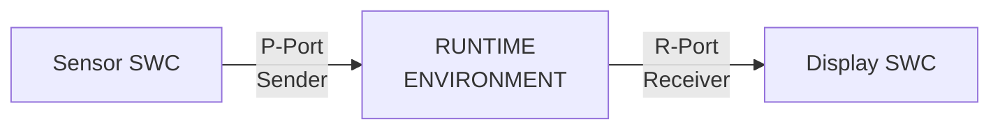

# AUTOSAR Application Layer


- Table of Contents:
  - Application Layer Overview
    - Data Types
    - Compu Methods
    - Software Components
  - RTE Layer Overview


- AUTOSAR Application Layer:

  - The topmost layer in AUTOSAR software architecture.
  - Application is the main layer to drive the Vehicle System.

  

  

  - Application is a group of components, interacting together to do specific funcitonality.
  - Software Components of the same application can be distributed over different ECUs in the Vehicle System.
  - SWC aren't necessarily part of the same ECU, they can be distributed over multiple ECUs.
  - SWC aren't necessarily functions.


- Virtual Function Bus (VFB): is a bus that has SWCs of all functionalities connected on it.
- RTE is the actual implementation of Virtual Function Bus. 


- VFB is a modeling for application to interact together through Virtual Connections.
- Gateway ECUs: they gateway from one bus to another (from one protocol to another)


- Application layer consists of various set of interconnected Software Components (SWCs)
- A SWC is the simplest form of an application that fulfills certain functionality.
- SWCs connect  to each other through ports to exchange data and services needed to fulfill the desired functionality.


- Base Datatype: such as uint8, uint16, uint32, etc.
- Implementation Datatypes: maps application datatypes to base datatypes
  e.g.: Application Datatype: Celsius (Application Dataype) mapped to uint8 (Base Datatype) 


AUTOSAR introduces these three layers to achieve a critical goal: **separation of concerns** and **portability**. It ensures that:

1. Application software components (SWCs) don't care about the underlying hardware (e.g., 8-bit vs 32-bit microcontroller).
2. The same application code can be easily ported to a different ECU without changes.
3. The meaning and physical units of data are clearly defined and consistent across the entire system.

Think of it like this:

- **Application Datatype:** What the data *means* (e.g., "Temperature").
- **Implementation Datatype:** How the data is *formatted and constrained* for a specific use case (e.g., "A number from -40 to 210 representing degrees Celsius").
- **Base Datatype:** How the data is *actually stored* in memory (e.g., `uint8` - a single byte).

------

### 1. Base Datatypes

- **What they are:** The fundamental building blocks. These are the primitive types provided by the programming language (C) and compiler that directly define the memory footprint and representation.
- **Purpose:** To define the physical storage of data in memory. They are hardware-dependent.
- **Examples:**
  - `uint8` (unsigned 8-bit integer)
  - `uint16` (unsigned 16-bit integer)
  - `sint32` (signed 32-bit integer)
  - `float32` (32-bit floating point)
  - `boolean` (typically mapped to `uint8`)

------

### 2. Implementation Datatypes

- **What they are:** A "wrapper" or "typedef" around a Base Datatype that adds **semantic meaning and constraints**. They map the abstract application concept to a concrete physical representation.
- **Purpose:** To define the range, precision, and encoding of a value that has a specific purpose in the application. This is where engineering decisions are made.
- **How they work:** They are defined using the Base Datatype and specify:
  - **`baseType`:** The underlying Base Datatype (e.g., `uint8`).
  - **`min` / `max`:** The allowed range of values.
  - **`resolution`:** The smallest step between values (e.g., 0.5).
  - **`offset`:** A constant offset.
  - **`unit`:** The physical unit (e.g., `degC`).
- **Example:**
  - **Name:** `Celsius_t`
  - **BaseType:** `uint8`
  - **Constraints:** `min = 0`, `max = 250`, `unit = "degC"`, `offset = -40`
  - **This means:** The value `0` in memory represents -40°C, the value `100` represents 60°C, and the value `250` represents 210°C.

------

### 3. Application Datatypes

- **What they are:** The most abstract level. These are the types used by the application software components (SWCs) to define their interfaces. They describe the *logical data* without any hardware or implementation details.
- **Purpose:** To allow application developers to work with meaningful concepts rather than raw bytes. This makes the code self-documenting and portable.
- **Examples:**
  - `Temperature`
  - `EngineSpeed`
  - `VehicleSpeed`
  - `DoorStatus` (e.g., with enum values: `DOOR_OPEN`, `DOOR_CLOSED`)

------

### How They Work Together: The Mapping

Your description and the slide show the crucial link: **mapping**.

1. The **Application Datatype** (e.g., `Temperature`) is used in the software component.
2. The AUTOSAR toolchain **maps** this abstract type to a specific **Implementation Datatype** (e.g., `Celsius_t`).
3. The Implementation Datatype is itself defined by its **Base Datatype** (e.g., `uint8`).

This mapping is configured in the AUTOSAR authoring tools and is a key part of the system design. The **RTE (Run-Time Environment)** uses this mapping to ensure that when one SWC sends a `Temperature` signal, it is correctly encoded and decoded into a `uint8` on the bus or between ECUs.

### Concrete Example:

| Layer                       | Example                                                      | Purpose                                                   |
| :-------------------------- | :----------------------------------------------------------- | :-------------------------------------------------------- |
| **Application Datatype**    | `Temperature`                                                | Describes the **logical concept** of temperature.         |
| **Implementation Datatype** | `Celsius_t` (uint8, min=0, max=250, offset=-40, unit="degC") | Defines the **encoding and constraints** for temperature. |
| **Base Datatype**           | `uint8`                                                      | Defines the **physical storage** (1 byte in memory).      |

**In Code, this might look like:**

c

```
/* This is generated by the AUTOSAR tooling */
typedef uint8 Celsius_t; // Implementation Datatype

/* The Application Developer uses the meaningful type */
Temperature currentEngineTemp; // Application Datatype

void MyComponent_Logic() {
    // The RTE handles the mapping from 'Temperature' to 'Celsius_t'
    currentEngineTemp = RTE_Read_Sensor_Temperature();

    if (currentEngineTemp > 100.0) { // Application works with logical values
        // ... trigger cooling ...
    }
}
```


This layered approach is why AUTOSAR is so powerful for complex, multi-supplier automotive systems. It creates a clear contract between application logic and hardware implementation.


### What is a CompuMethod?

A **CompuMethod** is a set of rules or a formula that defines how to convert between two representations of the same data:

1. **Internal Value:** The raw number as it is stored and processed in the software and on the bus (e.g., in a `uint8` variable).
2. **Physical Value:** The real-world, human-readable value with a unit that the number represents (e.g., temperature in °C, speed in km/h).

It's the "translator" between the digital world of the ECU and the physical world.

### Why are CompuMethods Needed?

In automotive systems, data is often compressed or encoded to save bandwidth on communication buses (like CAN) or to fit into a specific number of bits.

**Example:**

- A vehicle speed sensor needs to send a value from 0 to 300 km/h.
- Using a full `float32` (4 bytes) for this is inefficient on a CAN bus.
- Instead, we can use a `uint8` (1 byte) and define a scaling.
- The `uint8` can hold values from 0 to 255. We can scale this to represent 0 to 255 km/h. But what if we need up to 300 km/h?
- We can use a more complex scaling: `physical_value = (internal_value * 1.25) + 0`. Now, an internal value of `200` translates to `250 km/h`.

The CompuMethod defines this `(internal_value * 1.25) + 0` rule.

### How CompuMethods Work (The Transformation)

The slide's example of `km/hr` and `m/hr` hints at the two main types of transformations:

1. **Linear Scaling:** The most common type. It uses the formula:
   **`physical_value = (internal_value \* factor) + offset`**
   - **Factor (Slope):** The ratio between the internal and physical values (e.g., `1.25` in the speed example above).
   - **Offset:** A constant value added to the scaled internal value.
2. **Text Tables / Enumerations:** Used when an internal number represents a discrete state.
   - **Internal Value:** `0`, `1`, `2`
   - **Physical Value (Text):** `"DOOR_OPEN"`, `"DOOR_CLOSED"`, `"DOOR_AJAR"`
     *This is what the slide means by "Used for defining enumerations."*

### Real-World Example: Vehicle Speed

Let's use the `km/hr` example from the slide:

- **Application Datatype:** `VehicleSpeed`
- **Implementation Datatype:** `kph_t` (based on `uint8`)
- **CompuMethod:** `Linear_Scale_kph`
  - **Factor (slope):** `1.0`
  - **Offset:** `0.0`
  - **Unit:** `"km/hr"`
- **How it works:**
  - The software reads an **internal value** of `120` from a signal on the CAN bus.
  - The CompuMethod translates this to a **physical value**: `(120 * 1.0) + 0 = 120 km/hr`.
  - The application software can now use the logical value `120` (km/hr) without knowing how it was encoded on the wire.

### Another Example: Temperature Sensor

- **Internal Value (on CAN bus):** `100` (type `uint8`)
- **CompuMethod:** `Linear_Scale_DegC`
  - **Factor:** `1.0`
  - **Offset:** `-40.0`
  - **Unit:** `"°C"`
- **Physical Value:** `(100 * 1.0) + (-40) = 60 °C`

This is exactly the mapping from our previous datatype example, now formally defined by the CompuMethod

---------------------------


Of course. These two slides are fundamental to understanding how Software Components (SWCs) communicate in AUTOSAR. Let's break them down.

### Core Concept: SWCs are Like Lego Blocks

Imagine each Software Component (SWC) is a sealed Lego block. It has **bumps** (which *provide* something) and **holes** (which *require* something). For these blocks to connect and build a larger system, they need a standard way to link bumps to holes.

**Ports** are the bumps and holes. **Interfaces** define the shape and type of those bumps and holes.

### Slide 12: Port Interfaces (The "What")

An interface defines **what kind of communication** can happen through a port. It's the *contract* or *agreement* between two components.

#### 1. Sender-Receiver Interface (S/R)
*   **Analogy:** A **Radio Broadcast** or a **Newspaper**.
*   **How it works:** One SWC (**Sender**) sends out data (a signal). One or *many* other SWCs (**Receivers**) can choose to listen to and read that data.
*   **Characteristics:**
    *   **One-way** communication (Sender -> Receiver).
    *   **Data-centric.** It's all about passing values (e.g., `VehicleSpeed`, `EngineTemperature`).
    *   **Loose coupling.** The sender doesn't know or care who is listening.
*   **Use Case:** Perfect for continuously updating data like sensor values, status information, and commands.

#### 2. Client-Server Interface (C/S)
*   **Analogy:** A **Customer and a Shopkeeper**. You (the client) make a specific request and wait for a specific response.
*   **How it works:** One SWC (**Client**) calls a function (an **operation**) on another SWC (**Server**). The Server performs the operation and can return a result.
*   **Characteristics:**
    *   **Two-way** communication (Client -> Server -> Client).
    *   **Action-centric.** It's about requesting a task to be performed (e.g., `ReadData()`, `CalculateDistance()`, `OpenValve()`).
    *   **Tight coupling.** The client knows exactly which server it's calling.
*   **Use Case:** Perfect for requesting services, performing calculations, or triggering specific actions.

**The key line from the slide:** *"Interfaces are assigned to SWC Ports."* This means you decide if a specific port on an SWC will be used for broadcasting data (S/R) or for making function calls (C/S).

---

### Slide 13: SWC Ports (The "How")

Ports are the actual **connection points** on an SWC. They are the physical "bumps" and "holes" that get connected.

#### The Three Types of Ports:

1.  **P-Port (Provided Port):** This is a **bump** on the Lego block.
    *   It *provides* something to the outside world.
    *   For an **S/R Interface:** It is a **Sender** port (it provides data).
    *   For a **C/S Interface:** It is a **Server** port (it provides a service/function).

2.  **R-Port (Required Port):** This is a **hole** on the Lego block.
    *   It *requires* something from the outside world.
    *   For an **S/R Interface:** It is a **Receiver** port (it requires data).
    *   For a **C/S Interface:** It is a **Client** port (it requires a service/function).

3.  **PR-Port (Provided-Required Port):** This is a **special, two-way connector**.
    *   It can both *provide* and *require* functionality. This is used for more complex patterns, often in **mode management** or when a component needs to both send a request and receive a callback.

**The key line from the slide:** *"Functionality of the port is defined according to the Port Interface assigned to this port."* This means:
*   A **P-Port** + **Sender-Receiver Interface** = A **Data Sender**.
*   An **R-Port** + **Client-Server Interface** = A **Service Client**.

---

### How It All Works Together: A Simple Example

Let's say we have two SWCs: a **Sensor SWC** and a **Display SWC**.

**Goal:** The Display SWC should show the temperature value from the Sensor SWC.

1.  **Define the Interface:** We create a **Sender-Receiver Interface** called `TemperatureInterface` with a single data element `TemperatureValue` (type: `uint16`).

2.  **Assign Ports:**
    *   On the **Sensor SWC**, we create a **P-Port** and assign the `TemperatureInterface` to it. This makes it a **Sender** port.
    *   On the **Display SWC**, we create an **R-Port** and assign the `TemperatureInterface` to it. This makes it a **Receiver** port.

3.  **Connect the Ports:** In the system configuration, we draw a connection from the Sensor's **P-Port** to the Display's **R-Port**.

4.  **The Result:** At runtime, the Sensor SWC writes the value to its port. The AUTOSAR Runtime Environment (RTE) automatically takes care of delivering that value to the Display SWC's port.



This is the elegance of AUTOSAR: the application developers (the ones writing the Sensor and Display logic) don't need to know *how* the data gets from one component to the other. They just read and write to their ports, and the RTE handles the rest. This ensures portability and modularity.